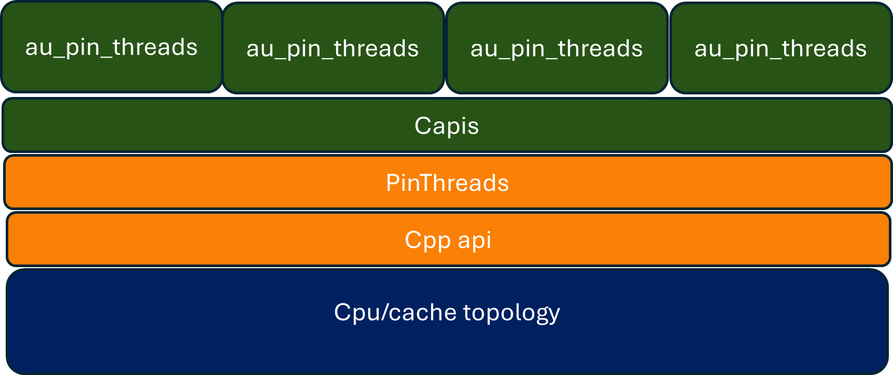

# AOCL-UTILS

  An effort to factor out common functionality across libraries.

## Table of Contents

- [AOCL-UTILS](#aocl-utils)
  - [Table of Contents](#table-of-contents)
  - [Project structure](#project-structure)
  - [BUILD AND INSTALL](#build-and-install)
    - [Dependencies](#dependencies)
    - [Getting started](#getting-started)
      - [Checkout the latest code](#checkout-the-latest-code)
      - [Configure](#configure)
      - [Build](#build)
      - [Install](#install)
  - [Testing](#testing)
  - [Examples](#examples)
  - [List of build options](#list-of-build-options)
  - [List of functionalities provided by each utils modules](#list-of-functionalities-provided-by-each-utils-modules)
    - [au\_core (internal)](#au_core-internal)
      - [Current API Stack(Core)](#current-api-stack-core)
    - [au\_cpuid](#au_cpuid)
      - [Current API Stack(Cpuid)](#current-api-stack-cpuid)
    - [aoclutils](#aoclutils)
  - [Integration with other projects](#integration-with-other-projects)
    - [CMAKE](#cmake)
    - [Make](#make)

## Project structure

The project is structured as follows:

- `Library`: This directory contains the source code for the project.

- `SDK`: The release folder.

- `Tests`: This directory contains the necessary unit tests for the project.

- `Tools`: The necessary tools to work with the project.

## BUILD AND INSTALL

### Dependencies

Refer [supported package matrix document](https://docs.amd.com/r/en-US/63866-AOCL-utils/Supported-package-Matrix)
(supported_package_matrix.md file)

### Getting started

Same commands can be used on both Linux and Windows. The only difference is the environment setup. The default compiler and generator used will be  the platform defaults.

For specific compiler and generator, use the following command:

```console
    cmake -DCMAKE_CXX_COMPILER=clang++ -DCMAKE_C_COMPILER=clang -G "Unix Makefiles" ..
```

**Note: Replace the compiler(clang) and generator(Unix Makefiles) with the required one.**

Refer [supported_package_matrix.md file](https://docs.amd.com/r/en-US/63866-AOCL-utils/Supported-package-Matrix) for the supported compiler and generator.

#### Checkout the latest code

```console
    git clone
    cd aocl-utils
```

#### Configure

```console
    cmake -B  default -DCMAKE_INSTALL_PREFIX=install_dir
```

#### Build

```console
    cmake --build default --config release -j
```

#### Install

```console
    cmake --install default --config release
```

This command creates

1. The necessary header files in the \<Install Path\>/includefolder
2. static and dynamic library files corresponding to modules core(au_core) and cpuid(au_cpuid)
    Link with these libraries based on the functionality required.
**Note:**
   1. This command creates lib/lib64 directory for the binaries. To have custom library path, use CMAKE_INSTALL_LIBDIR.
   2. Rightly update the include path and library path in the project to link with the installed libraries. or use LD_LIBRARY_PATH to point to the installed library path.(PATH environment variable in windows)
   3. Refer to the [API documentation](https://docs.amd.com/r/en-US/63866-AOCL-utils) and examples in the Example folder to understand how to link and use the modules.

**Important:**

```console
    1. Most of the CPUID APIs(Along with the headers) from 4.2 release is deprecated and will be removed in the future release. Refer to the API documentation for the new APIs.
    2. The old APIs can be enabled using AU_ENABLE_OLD_API=ON during build, otherwise utils build will throw deprecated warnings.
    3. The aoclutils module is a combination of au_core and au_cpuid modules.
    4. The aoclutils module is the default module to be used for all the functionalities.
```

## Testing

Build with AU_BUILD_TESTS=ON to run the tests.

```console
    ctest -C release
```

qemu-x86_64 is a dependency for running tests. Install it using the following command:

```console
    sudo apt-get install qemu-user # For Ubuntu
    sudo dnf install qemu-user # For Fedora/RHEL/CentOS
    # qemu tests are disable on windows as qemu-user is not available on windows
```

## Examples

Build with AU_BUILD_EXAMPLES=ON to run the examples.

```console
    cmake -B default -DAU_BUILD_EXAMPLES=ON
    cmake --build default --config release -j
```

The binaries are in the default/release folder. Refer to the SDK/Examples folder Readme.md for details on out of tree compilation.

## List of build options

```console
Build FLags                             Description                  Default         Alternate Values
--------------------------------------------------------------------------------------------------
AU_BUILD_DOCS                           Generate Docs during build   OFF            ON
AU_BUILD_EXAMPLES                       Build examples               OFF            ON
AU_BUILD_TESTS                          Build tests                  OFF            ON
AU_BUILD_TYPE                           Build type                   Release        Debug, Developer
AU_ENABLE_OLD_API                       Enable OLD alci_* APIs       OFF            ON                  Use to avoid deprecation warnings
AU_BUILD_SHARED_LIBS                    Build shared  libraries      ON             OFF
AU_BUILD_STATIC_LIBS                    Build static libraries       ON             OFF
```

## List of functionalities provided by each utils modules

### au_core (internal)

| Functionality | Headerfiles(C)   | Headerfiles(C++) |
| ------------- | --------------   | ---------------- |
| thread pinning| ThreadPinning.hh | threadpinning.h |

#### Current API Stack(Core)

1. ThreadPinning



### au_cpuid

| Functionality | Headerfiles(C)   | Headerfiles(C++) |
| ------------- | --------------   | ---------------- |
| cpu architecture detection | cpuid.h | X86Cpu.hh |
| cpuid feature flag detection | cpuid.h | X86Cpu.hh |
|  Deprecated APIs | arch.h |  cpu.hh |

#### Current API Stack(Cpuid)


**Note**

1. The APIs in the grey box are deprecated and will be removed in the future release.
2. X86Cpu.hh(CPP)/cpuid.h(C) is the new header file that contains the new APIs.

### aoclutils

- All features of au_cpuid and au_core combined.

The C headers are in the \<installpath\>/include/Capi folder and the C++ headers are in the include/Au folder.
Deprecated APIs are in the include/alci folder.
**Note: Refer to [API documentation](https://docs.amd.com/r/en-US/63866-AOCL-utils/Cpuid-API-Reference) and Examples in Examples folder to understand how to link and use the modules.**

## Integration with other projects

Following are the build systems to integrate in library/application with AOCL-Utils:

### CMAKE

In the CMake file, use the following:

```console
TARGET_INCLUDE_DIRECTORIES() – path of libaoclutils include directory

TARGET_LINK_LIBRARIES() – path to link libaoclutils binaries
```

### Make

In the compiler flags of Make file, use the following:

```console
“–I” - path of libaoclutils include directory

“-l, -L” - path to link libaoclutils binaries
```
