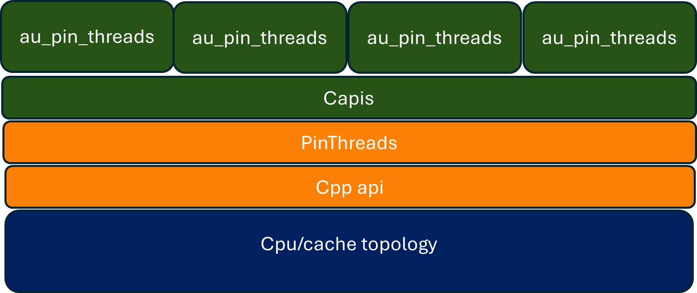
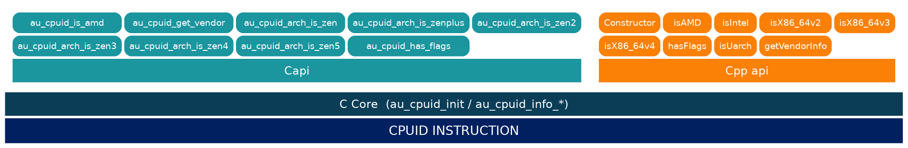

<!-- Copyright (C) 2026, Advanced Micro Devices. All rights reserved. -->

# AOCL-UTILS

AOCL-Utils is an effort to extract common functionalities across
libraries. Its main features include:

- Au_cpuid
  - Core details
  - Available flags
  - Usable ISA

- Au_core_module
  - Thread pinning
  - Status
  - Logger
  - RNG

**NOTE:**
The library provides AMD Zen microarchitecture detection and also reports
generic x86 vendor and feature information for Intel-compatible consumers and
tests. Some AMD-specific utilities may fail or behave unexpectedly on older
AMD architectures.

Core module is internal to AOCL-Utils. To use its features, link to libaoclutils, which
combines all available utility modules.

## Table of Contents

- [AOCL-UTILS](#aocl-utils)
  - [Table of Contents](#table-of-contents)
  - [Project structure](#project-structure)
  - [BUILD AND INSTALL](#build-and-install)
    - [Dependencies](#dependencies)
    - [Getting started](#getting-started)
      - [Checkout the latest code](#checkout-the-latest-code)
      - [Configure](#configure)
      - [Build](#build)
      - [Install](#install)
  - [Testing](#testing)
  - [Examples](#examples)
  - [List of build options](#list-of-build-options)
  - [List of functionalities provided by each utils modules](#list-of-functionalities-provided-by-each-utils-modules)
    - [au\_core (internal)](#au_core-internal)
      - [Current API Stack(Core)](#current-api-stack-core)
    - [au\_cpuid](#au_cpuid)
      - [Current API Stack(Cpuid)](#current-api-stack-cpuid)
    - [aoclutils](#aoclutils)
  - [Integration with other projects](#integration-with-other-projects)
    - [CMAKE](#cmake)
    - [Make](#make)

## Project structure

The project is structured as follows:

- `Library`: This directory contains the source code for the project.

- `SDK`: The release folder.

- `Tests`: This directory contains the necessary unit tests for the project.

- `CMake`: CMake modules, presets, and build helpers.

- `scripts`: Utility scripts to work with the project.

- `docs`: Doxygen, Sphinx, API, and test-plan documentation.

## BUILD AND INSTALL

### Dependencies

Refer to the [supported package matrix](docs/SupportedPackageMatrix.md), which
is the project's source of truth for supported compilers, generators, and
runtime/test dependencies.

### Getting started

The same commands apply to both Linux and Windows. Only the environment setup differs.
The default compiler and generator are the platform defaults.

For a specific compiler and generator:
```console
cmake -DCMAKE_CXX_COMPILER=clang++ -DCMAKE_C_COMPILER=clang -G "Unix Makefiles" ..
```
**Note:** Replace clang with the chosen compiler and "Unix Makefiles" with the chosen generator.

#### Checkout the latest code

```console
    git clone <repository-url> aocl-utils
    cd aocl-utils
```

#### Configure

```console
    cmake -S . -B default -DCMAKE_BUILD_TYPE=Release \
        -DCMAKE_INSTALL_PREFIX=install_dir
```

#### Build

```console
    cmake --build default --config Release -j
```

#### Install

```console
    cmake --install default --config Release
```
This command places:

1. Header files in `<Install Path>/include`
2. Static and dynamic libraries for the enabled modules and `aoclutils`

**Note:**
   1. Libraries are installed under `<Install Path>/<CMAKE_INSTALL_LIBDIR>`
      (normally `lib`). Set `CMAKE_INSTALL_LIBDIR` to choose another path.
   2. Update the include and library paths in consumers, or use
      `LD_LIBRARY_PATH` on Linux and `PATH` on Windows.
   3. Refer to the local [Sphinx API documentation](docs/index.rst) and the
      [Sphinx build guide](docs/SphinxBuildGuide.md) to understand the current
      APIs and examples. Public AMD API references may link to their published
      AMD documentation where appropriate.

**Important:**
1. The legacy 4.0-style `alci_*`/`alcpu_*` CPUID APIs have been removed, along with the
   last two deprecated entry points: `Au::X86Cpu::isAvailable()` (C++) and the singular
   `au_cpuid_has_flag()` (C). Use `hasFlag()` and `au_cpuid_has_flags()` respectively --
   note the latter takes an array of flag-name strings plus a count and returns a plain
   `bool`, so unlike the removed singular form there is nothing to free. See the
   [migration guide](docs/root/cpuid/api/legacy_api_migration_summary.md) for the
   old->new mapping.
2. Deprecation warnings for any remaining deprecated APIs are shown by default and can be
   turned off by configuring with `-DAU_WARN_DEPRECATION=OFF`.
3. The aoclutils module combines au_core and au_cpuid.
4. The aoclutils module is the default module for all functionalities.

## Testing

Configure and build with `AU_BUILD_TESTS=ON`:
```console
cmake -S . -B default -DCMAKE_BUILD_TYPE=Release -DAU_BUILD_TESTS=ON
cmake --build default --config Release -j
ctest --test-dir default -C Release --output-on-failure
```

QEMU (`qemu-x86_64`) is required for the emulated CPUID cases on Linux:

```console
    sudo apt-get install qemu-user # For Ubuntu
    sudo dnf install qemu-user # For Fedora/RHEL/CentOS
    # QEMU-backed CPUID cases are unavailable on Windows
```

**GCC 8.x / AOCC note:** When `AU_BUILD_TESTS=ON` on Linux, the CPUID QEMU
test uses C++17 `std::filesystem`. GCC/G++ 8.x keeps that implementation in a
separate `libstdc++fs` library. The same requirement applies to
Clang/Clang++ (including AOCC) when it selects a GCC 8.x toolchain. Configure
with `-lstdc++fs` in `CMAKE_CXX_STANDARD_LIBRARIES`:

```console
cmake -S . -B default -DCMAKE_BUILD_TYPE=Release \
    -DAU_BUILD_TESTS=ON \
    -DCMAKE_CXX_STANDARD_LIBRARIES="-lstdc++fs"
```

Append this flag to any existing `CMAKE_CXX_STANDARD_LIBRARIES` values, such
as `-lpthread`, `-ldl`, or `-lutil`. Modern libstdc++ versions generally do
not need this flag; if a version still ships a compatibility `libstdc++fs`
archive, passing it is harmless. A libc++-only toolchain does not provide
`libstdc++fs`, so passing this flag there fails.

Other direct-link tests, including the Mock-CPUID tests, can run on Windows;
only Linux loader-specific cases are skipped there.

## Examples

Build with `AU_BUILD_EXAMPLES=ON` to enable examples:
```console
cmake -S . -B build -DCMAKE_BUILD_TYPE=Release -DAU_BUILD_EXAMPLES=ON
cmake --build build --config Release -j
```

The binaries are in `build/Release`. Refer to
`SDK/Examples/Readme.md` for in-tree and standalone example details.

## List of build options

```console
Build Flags                              Description                  Default   Alternate
----------------------------------------------------------------------------------------
AU_BUILD_DOCS                            Generate Docs during build   OFF       ON
AU_BUILD_EXAMPLES                        Build examples               OFF       ON
AU_BUILD_TESTS                           Build tests                  OFF       ON
CMAKE_BUILD_TYPE                         Build type                   Release   Debug, Developer, RelWithDebInfo
AU_ENABLE_FEATURES                       Select modules/features      all       module:feature,...
AU_BUILD_MOCKCPUID_SHIM                  Build test-only CPUID shim   OFF       ON
AU_BUILD_SHARED_LIBS                     Build shared libraries       ON        OFF
AU_BUILD_STATIC_LIBS                     Build static libraries       ON        OFF
AU_STATIC_FORCE_CRT_MD                   Use dynamic MSVC CRT static   OFF       ON
AU_BUILD_WITH_ASAN                       Enable ASAN options          OFF       ON
AU_BUILD_WITH_TSAN                       Enable TSAN options          OFF       ON
AU_BUILD_WITH_MEMSAN                     Enable MEMSAN options        OFF       ON
AU_ENABLE_CODE_COVERAGE                  Enable code coverage         OFF       ON
AU_ENABLE_SLOW_TESTS                     Enable slow tests             OFF       ON
AU_ENABLE_BROKEN_TESTS                   Enable broken tests           OFF       ON
AU_ENABLE_ASSERTIONS                     Enable assertions             OFF       ON
AU_WARN_DEPRECATION                      Warn on deprecated API use   ON        OFF
```

## List of functionalities provided by each utils modules

### au_core (internal)

| Functionality  | Headerfiles(C)            | Headerfiles(C++)       |
| -------------- | ------------------------- | ---------------------- |
| thread pinning | Capi/au/threadpinning.h   | Au/ThreadPinning.hh    |
| status         |                           | Au/Status.hh           |
| logger         | Capi/au/logger.h          | Au/Logger/Logger.hh    |

#### Current API Stack(Core)

1. ThreadPinning



### au_cpuid

| Functionality                | Headerfiles(C)        | Headerfiles(C++)         |
|------------------------------|-----------------------|--------------------------|
| cpu architecture detection   | Capi/au/cpuid/cpuid.h | Au/Cpuid/X86Cpu.hh       |
| cpuid feature flag detection | Capi/au/cpuid/cpuid.h | Au/Cpuid/X86Cpu.hh       |

#### Current API Stack(Cpuid)



**Note**

1. The APIs in the grey box are deprecated and will be removed in the future release.
2. `Au/Cpuid/X86Cpu.hh` (C++) and `Capi/au/cpuid/cpuid.h` (C) contain the
   current library-backed APIs.

### aoclutils

- All features of au_cpuid and au_core combined.

The C headers are in the \<installpath\>/include/Capi folder and the C++ headers are in the include/Au folder.
**Note: Refer to the local [Sphinx API documentation](docs/index.rst), the
[Sphinx build guide](docs/SphinxBuildGuide.md), and the examples under
`SDK/Examples` to understand how to build and use the modules. Public AMD API
references may link to their published AMD documentation where appropriate.**

## Integration with other projects

Following are the build systems to integrate in library/application with AOCL-Utils:

### CMAKE

In the CMake file, use the following:

```console
TARGET_INCLUDE_DIRECTORIES() – path of libaoclutils include directory

TARGET_LINK_LIBRARIES() – path to link libaoclutils binaries
```

### Make

In the compiler flags of Make file, use the following:

```console
“–I” - path of libaoclutils include directory

“-l, -L” - path to link libaoclutils binaries
```
