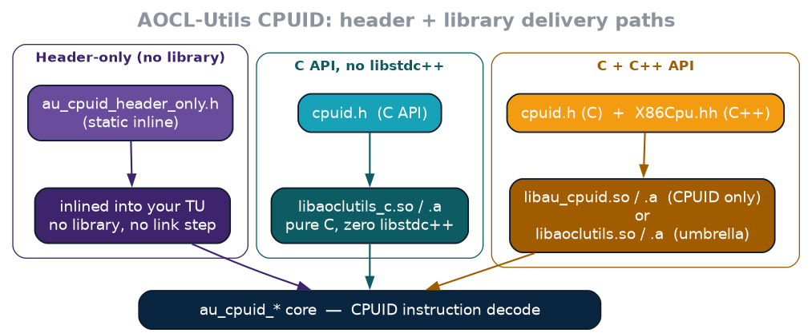

<!-- Copyright (C) 2026, Advanced Micro Devices. All rights reserved. -->

# AOCL-Utils Integration Guide

AOCL-Utils ships the same functionality through several different libraries
and headers, and picking the wrong one is an easy mistake to make -- link the
umbrella when you only needed the C API, or include a header that silently
requires a library you never linked. This guide exists to answer one
question up front: **for the API you want to call, which header do you
include, and which library (if any) do you need to link?**

## TL;DR

- Not sure what you need? Include `Capi/au/cpuid/cpuid.h` (or the C++
  equivalents under `Au/`) and link `AoclUtils::aoclutils` (or
  `libaoclutils.so`/`.a` if you're not using the CMake package). It contains
  every module and is the safe default.
- Only need CPUID, want to avoid pulling in libstdc++, and are fine writing
  pure C? Link `libaoclutils_c` instead.
- Only need CPUID and don't want to link anything at all? Include
  `Capi/au/cpuid/au_cpuid_header_only.h` and skip the rest of this document.
- Need Logger, ThreadPinning, Environ, or RNG? There is no split library for
  these yet -- `libaoclutils` (the umbrella) is the only option.

## Libraries at a glance

Every library below is produced by the same build (`BUILD_SHARED_LIBS` -- the
canonical switch, which `AU_BUILD_SHARED_LIBS` mirrors and cannot be overridden
independently of -- and `AU_BUILD_STATIC_LIBS`, both default `ON`, gate the
shared/static variant respectively -- neither library is behind a separate
opt-in switch).

| Library (Linux) | Library (Windows) | CMake target (`find_package(AoclUtils)`) | Contains | Needs libstdc++ / C++ runtime |
|---|---|---|---|---|
| `libaoclutils.so` | `libaoclutils.dll` + `libaoclutils.lib` | `AoclUtils::aoclutils` | Everything: CPUID (C + C++), Logger, ThreadPinning, Environ, RNG, Status | Yes |
| `libaoclutils.a` | `libaoclutils_static.lib` | `AoclUtils::aoclutils_static` | Same as above, static | Yes |
| `libau_cpuid.so` | `au_cpuid.dll` + `au_cpuid.lib` | `AoclUtils::au_cpuid` | CPUID only (C + C++), self-contained | Yes |
| `libau_cpuid.a` | `au_cpuid_static.lib` | `AoclUtils::au_cpuid_static` | Same as above, static | Yes |
| `libaoclutils_c.so` | `aoclutils_c.dll` + `aoclutils_c.lib` | `AoclUtils::aoclutils_c_shared` | CPUID **C API only** | **No** |
| `libaoclutils_c.a` | `aoclutils_c_static.lib` | `AoclUtils::aoclutils_c_static` | Same as above, static | **No** |
| *(none)* | *(none)* | *(none)* | CPUID C API, header-only | No -- no library at all |

Notes:

- `libau_cpuid` and `libaoclutils_c` both export the *same* CPUID C symbol
  names (`au_cpuid_*`) as `libaoclutils` -- this is intentional ("diamond"
  delivery: pick whichever one fits your build, they're interchangeable for
  CPUID). **Do not link more than one of `aoclutils`, `au_cpuid`, and
  `aoclutils_c` into the same static binary** -- note the linker will not
  necessarily stop you: with plain archives it quietly resolves the
  `au_cpuid_*` symbols from whichever archive it reaches first, so which
  implementation you ship becomes link-order dependent. You only get loud
  duplicate-symbol errors if something forces both archives in (e.g.
  `--whole-archive` / `-force_load`). Shared libraries tolerate this better
  (the dynamic loader picks one definition), but it's still not a supported
  configuration.
- `libaoclutils_c` is genuinely libstdc++-free: its one translation unit
  (`Library/Capi/cpuid_c_export.c`) is compiled as C and links nothing else.
  Verified with `ldd`: `libaoclutils_c.so` has no `libstdc++.so.6` dependency;
  `libaoclutils.so` and `libau_cpuid.so` both do.
- There is no `libau_core`, `libau_logger`, `libau_threadpinning`, or
  `libau_environ`. Logger, ThreadPinning, Environ, RNG, and Status are only
  ever available bundled inside `libaoclutils`.
- pkg-config (`aocl-utils.pc`) only describes the umbrella (`-laoclutils`).
  There is no `.pc` file for `au_cpuid` or `aoclutils_c` -- use the CMake
  package or link them manually.
- Installed headers live under `<prefix>/include/Capi/au/**` (C) and
  `<prefix>/include/Au/**` (C++).

## CPUID: full API-by-library matrix

CPUID is the one module with multiple delivery paths, so it gets its own
table. All of these are equivalent at the API level -- same function
signatures, same behavior -- they differ only in what you link (or don't).
The split exists to let C-only consumers avoid a libstdc++ dependency: the
umbrella and `au_cpuid` are C++ libraries under the hood, so `aoclutils_c`
(pure C) and the header-only variant (no library at all) exist specifically
for callers who can't or don't want to pull in the C++ runtime.



### C API (`au_cpuid_*` symbols)

| Header | `libaoclutils_c` | `libau_cpuid` | `libaoclutils` | Link required? |
|---|:---:|:---:|:---:|---|
| `Capi/au/cpuid/cpuid.h` | Yes | Yes | Yes | Yes -- pick exactly one library above |
| `Capi/au/cpuid/au_cpuid_header_only.h` | -- | -- | -- | **No.** `static inline`, single generated file, self-contained |
| `Capi/au/cpuid/cpuid_inline.h` | -- | -- | -- | **No**, but pulls in sibling headers (`cpuid_core.h`, `cache.h`, ...) from the same directory -- use `au_cpuid_header_only.h` instead unless you need to modify the split-header source directly |

### C++ API (`Au::X86Cpu`, `Au::Cache`, ...)

| Header | `libau_cpuid` | `libaoclutils` | Link required? |
|---|:---:|:---:|---|
| `Au/Cpuid/X86Cpu.hh` | Yes | Yes | Yes |
| `Au/Cpuid/CacheInfo.hh`, `CpuidUtils.hh`, `Enum.hh`, `Platform.hh` | Yes | Yes | Yes |

There is **no C++ CPUID API in `libaoclutils_c`** -- it is a pure-C library
by design (that's the entire point of it existing: zero libstdc++). If you
need `Au::X86Cpu`, you must link `libau_cpuid` or `libaoclutils`.

### Picking a CPUID path

- **Default / don't know yet:** `cpuid.h` (C) or `X86Cpu.hh` (C++) + link
  `libaoclutils`.
- **Already linking `libaoclutils` for something else (Logger,
  ThreadPinning, ...):** just use it for CPUID too, don't add another
  library.
- **Standalone CPUID-only consumer, C or C++, want a smaller/self-contained
  library instead of the full umbrella:** `libau_cpuid`.
- **C-only consumer that must not pull in libstdc++** (e.g. a C runtime, a
  library with its own incompatible C++ ABI/CRT policy): `libaoclutils_c`.
- **Header-only, no build-system integration, no linking at all:**
  `au_cpuid_header_only.h`. Good for a single translation unit, a vendored
  drop-in, or a build that can't add a new link dependency at all. Trade-off:
  the API is emitted `static inline` into every TU that includes it -- larger
  binaries if included widely, and you get whatever CPUID logic shipped with
  that header snapshot rather than a shared library you can update
  independently.

## Every other module (Logger, ThreadPinning, Environ, RNG, Status)

These only ship inside the umbrella. There is no split-library or
header-only equivalent today.

| Module | C API header | C API symbol prefix | C++ header | Library |
|---|---|---|---|---|
| Logger | `Capi/au/logger/logger.h` | `au_logger_*` | `Au/Logger.hh` (`Au::Logger::*`) | `libaoclutils` only |
| ThreadPinning | `Capi/au/threadpinning.h` | `au_pin_threads_*` | `Au/ThreadPinning.hh` (`Au::ThreadPinning`) | `libaoclutils` only |
| Environ | `Capi/au/environ.h` | `au_env_*` | `Au/Environ.hh` (`Au::Environ`) | `libaoclutils` only |
| Status / Error | -- (no C API) | -- | `Au/Status.hh`, `Au/StatusOr.hh`, `Au/Error.hh` (`Au::Status`, `Au::StatusOr<T>`, `Au::GenericError`) | `libaoclutils` only |
| RNG | -- (no C API) | -- | `Au/Rng/SystemRng.hh`, `Au/Rng/HardwareRng.hh`, `Au/Rng/Drbg.hh` | `libaoclutils` only |

Status is what CPUID's `X86Cpu::buildFromCore()` returns
(`StatusOr<X86Cpu>`) -- that's why `libau_cpuid` bundles its own private copy
of the Status/GenericError/SourceLocation objects rather than depending on
`libaoclutils`: two public libraries with the same Status symbols would
collide the same way `aoclutils`/`au_cpuid`/`aoclutils_c` do for CPUID.

## Integration methods

### CMake (recommended)

```cmake
find_package(AoclUtils REQUIRED)
target_link_libraries(your_target PRIVATE AoclUtils::aoclutils)     # umbrella
# or, CPUID-only:
# target_link_libraries(your_target PRIVATE AoclUtils::au_cpuid)
# or, CPUID C API, no libstdc++:
# target_link_libraries(your_target PRIVATE AoclUtils::aoclutils_c_shared)
```

`find_package(AoclUtils)` exports include directories along with every
target above -- no separate `target_include_directories()` call is needed.
(On Windows the `aoclutils`/`au_cpuid` targets are currently installed without
`INCLUDES DESTINATION`, so add `-I<prefix>/include` yourself there.)
Static variants are the same names with `_static` appended
(`AoclUtils::aoclutils_static`, `AoclUtils::au_cpuid_static`,
`AoclUtils::aoclutils_c_static`).

### pkg-config

```console
$ pkg-config --cflags --libs aocl-utils
-I<prefix>/include -L<prefix>/lib -laoclutils
```

Only covers the umbrella. If you need `au_cpuid` or `aoclutils_c` standalone
via pkg-config, there is currently no `.pc` file for them -- pass
`-I`/`-L`/`-l` manually or switch to the CMake package.

### Raw compiler flags (Make or anything else)

```console
-I<prefix>/include                 # headers (Capi/, Au/)
-L<prefix>/lib -laoclutils         # or -lau_cpuid / -laoclutils_c
```
